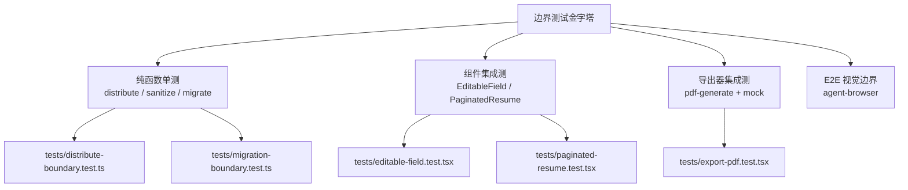

## 用户需求

作为专业测试专家，为「编辑器 → 预览 → 导出 PDF」全链路设计边界 case 测试方案，覆盖从非受控就地编辑、A4 分页测量与分配到最终逐页截图合成 PDF 的每一处易错临界点。

## 产品概述

Résumé Studio 是纯前端、本地优先的简历排版工具。用户在预览区以 `contentEditable` 就地编辑（非受控组件），富文本经清洗后写入单一 store；`buildBlocks` + `distributeBlocks` 把内容切成原子块并分配到固定高度的 A4 页；`pdf-generate` 导出器读取 `.print-area` 逐页 `html2canvas-pro` 截图后由 `jsPDF` 拼成 PDF。

## 核心测试场景（边界 case）

- **编辑器边界**：非受控同步（聚焦不回写防光标丢失）、输入 300ms 防抖、粘贴富文本清洗（剥离 script/style/on*）、IME 组合输入不重复提交、空值占位。
- **预览/分页边界**：内容恰好满页（阈值 `-0.5`）、单块高于整页（溢出裁切不死循环）、`keepWithNext` 标题不孤行临界、`document.fonts.ready` 失败/永不就绪、密度变化触发重排、侧栏版式每页重复侧栏。
- **导出边界**：0 页返回 null 不崩、多页全部合成、字体未就绪仍出图、iOS 用户手势内 `window.open`、`basics.name` 为空或含特殊字符时的文件名兜底。
- **持久化边界**：localStorage 损坏/非 JSON、v1→v2 升级补 `fields`、缺失/非法语言字段被剔除、未知 kind 章节跳过渲染但数据保留、切语言不污染撤销历史。
- **E2E 视觉边界**：真实浏览器内 editor→preview→PDF，核对分页断点、中文/日文渲染、强调色、无系统页脚。

## 技术栈选择

- **测试框架**：Vitest（jsdom 环境，项目已配置 `tests/setup.ts`），复用现有 `@testing-library/react` 约定（`.tsx` 用例）。
- **计时控制**：`vi.useFakeTimers()` 覆盖 300ms 输入防抖、400ms 撤销合并、600ms 自动保存、RAF 与 `document.fonts.ready`。
- **动态依赖 mock**：`vi.mock('jspdf')` 与 `vi.mock('html2canvas-pro')` 提供工厂，避免真实 canvas/网络。
- **E2E**：`agent-browser` 真实浏览器核对（仅视觉边界，非 CI）。

## 实现方案

分层边界测试金字塔：纯函数单测（distribute/sanitize/migrate/localized）→ 组件集成测（EditableField、PaginatedResume，jsdom + 假定时器 + mock fonts.ready/raf）→ 导出器集成测（mock jspdf/html2canvas-pro）→ 真实浏览器 E2E 核对。重点覆盖现有 4 大缺口：pdf-generate 链路、EditableField IME/粘贴、PaginatedResume 测量时序、distribute 临界。

**关键决策**：

1. 导出器用 `vi.mock` 拦截动态 `import('jspdf')` / `import('html2canvas-pro')` 的 default 工厂，返回带 `output('blob')` 与 `toDataURL` 的桩，使导出逻辑可在 jsdom 内断言，不触发真实截图。
2. 字体时序用 `Object.defineProperty(document, 'fonts', { ready: Promise })` 注入 resolve/reject，验证 `.catch(run)` 兜底分支。
3. IME 边界先于实现：编写「compositionstart/input/compositionend」序列用例，若当前实现（无 composition 处理）未通过，则在 `editable-field.tsx` 增加一个轻量 composition 守卫（输入期间挂起 emit），保证不破坏非受控同步契约（NFR-2）。

## 实现注意（防回归）

- 新测试遵循现有模式，`.tsx` 后缀承载 JSX；不新增 `@ts-ignore`，未用参数 `_` 前缀。
- mock `URL.createObjectURL/revokeObjectURL` 与 `window.open`，避免污染与泄漏；E2E 步骤加 `.no-print`/`print-area` 核对。
- 不改动 `distributeBlocks` 纯函数语义，仅扩充用例；改完跑 `npm run test && npm run lint && npm run build && npm run verify:rules`。
- 保持 lint 基线（0 error、≤2 warning），新增 warning 仅限既有限制模式。

## 架构设计



## 目录结构

```
tests/
├── distribute-boundary.test.ts   # [NEW] 分页临界：恰好满页、单块高于整页、keepWithNext 临界、批量多页。复用 distributeBlocks 纯函数，校验无死循环/不丢块。
├── editable-field.test.tsx       # [NEW] 非受控同步（聚焦不回写）、300ms 防抖 emit、粘贴清洗（script/style/on* 剥离）、IME 组合输入、空值占位。必要时代 editable-field.tsx 加 composition 守卫。
├── paginated-resume.test.tsx     # [NEW] 测量时序：fonts.ready resolve/reject 均出页、RAF 后重排、density 变化重算、sidebar 版式每页重复侧栏。需 I18nProvider + store 包裹。
├── export-pdf.test.tsx           # [NEW] 导出边界：0 页返回 null、多页合成、字体失败仍出图、iOS window.open 手势、空/特殊文件名兜底。vi.mock jspdf + html2canvas-pro。
└── migration-boundary.test.ts    # [NEW] 持久化边界：损坏 JSON、v1→v2 补 fields、缺失/非法语言字段剔除、未知 kind 保留、切语言不进 undo。
```

（E2E 视觉边界核对不落盘为测试文件，由 agent-browser 按清单执行。）

## 关键代码结构（导出器 mock 模式）

```ts
// tests/export-pdf.test.tsx 内对动态依赖的工厂 mock（非真实 API，仅为测试桩形态）
vi.mock("jspdf", () => ({ jsPDF: class { addPage(){} addImage(){} output(){ return new Blob(); } } }));
vi.mock("html2canvas-pro", () => ({ default: async () => ({ toDataURL: () => "data:," }) }));
```

## Agent Extensions

### Skill

- **agent-browser**
- Purpose: 在真实浏览器内驱动 editor→preview→导出 PDF，核对分页断点、CJK 字体渲染、强调色、无系统页脚等仅 jsdom 无法覆盖的视觉边界。
- Expected outcome: 产出一份边界核对清单与截图证据，确认全链路在真实浏览器下无溢出/错位/崩溃。