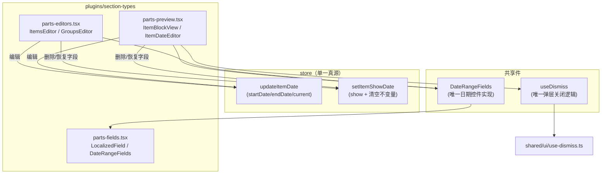

## 产品概述

对最近两次迭代（日期就地编辑、判空修复）做结构性收敛重构。功能已正确且有测试覆盖，但迭代方式是在既有结构上打补丁，产生了三处结构性重复与一处契约缺口。本方案在不改变用户可见行为的前提下，消除重复、补齐单一真源、去除 kind 硬编码，并把风险最高的插件契约变更拆为独立里程碑。

## 核心需求

1. **日期编辑单一真源**：预览弹层与左面板共用同一套日期控件实现；删除/恢复日期字段的语义与副作用收敛到 store 的一个 action，两个编辑面行为一致。
2. **补齐 showDate 缺口**：左面板必须感知 `showDate`，字段被删除时提供恢复入口，避免"左面板能填、预览永不显示"的矛盾。
3. **去除 kind 硬编码**：清掉 `emptySections` 中最后一个 `section.kind === "summary"` 分支，使判空逻辑不再随插件新增章节而失效。
4. **拆分膨胀文件**：`parts.tsx`（546 行 / 8 个组件）按职责拆为预览渲染、左面板编辑、通用表单件三个文件。
5. **收口重复实现**：弹层的外部点击/Esc 关闭逻辑与 `DropdownMenu` 合并为共用 hook；"不上纸"的两条 CSS 规则建立成对维护约束。
6. **可选里程碑：契约补全**：`renderBlock` 增加 editors 参数，使落地页示例真正只读，不再写脏用户真实简历。

## 约束（来自项目规则，方案必须遵守）

- A1：`shared/`、`entities/` 禁止 import `store`/`features`/`widgets`/`pages`/`plugins`
- A3/A4：插件须在 `src/plugins/<category>/`，插件不得依赖 `pages`/`widgets`
- G5：禁止按章节 kind 硬编码分支
- I1/I3：新增界面文案必须经 `t()`，且五语（zh/en/ja/de/ko）齐全
- E1/E2/E3：禁 emoji、图标只用 lucide-react、禁 `@ts-ignore`
- 新增/修改纯逻辑必须补 Vitest；含 JSX 的测试用 `.tsx`，规则自检用 `.mjs`
- 每阶段提交前跑通：`verify:rules` → `typecheck` → `lint` → `test`，改动 i18n 另跑 `node scripts/verify-i18n-keys.mjs`

## 技术栈

沿用项目现有技术栈，不引入新依赖：React 18 + TypeScript + Vite + Tailwind v4（CSS-first，无 config）+ Zustand（含 zundo 撤销）+ Vitest（jsdom）+ FSD 分层 + 自研插件契约 + 自研规则自检脚本（`scripts/rules/*.mjs`）。

## 实现方案

采用**分阶段、每阶段可独立提交并通过质量门**的渐进式重构，避免一次性大改。核心策略是"先抽共用件、再改行为、最后做文件搬迁"，使每一步 diff 都小而可审。

**关键决策与权衡：**

1. **先用共用件消灭重复，再改行为**：先抽出 `DateRangeFields` 与 `useDismiss`，让后续的行为修复（showDate 感知）只改一处，避免两处同步改漏。
2. **把"删除字段即清空值"这条不变量下沉到 store**：新增 `setItemShowDate(sectionId, itemId, show)` 统一封装，而不是在组件的 `onClick` 里拼 `{ showDate:false, startDate:"", ... }`。理由：这是跨两个编辑面共享的业务不变量，且下沉后可纯函数单测；放在组件里会随编辑面增多而再次漂移（当前预览弹层已写死一次，左面板再加就会第二次写死）。
3. **判空去 kind 硬编码选择"删分支"而非"插件化"**：`shared` 因规则 A1 无法 import 插件注册表，短期内无法让插件自述"我是分组型/摘要型"。但 `summary` 分支本身语义存疑（`summary.tsx` 设 `hasHeader:false`，而 `showHeader = hasHeader || Boolean(title)`，只填 title 的 summary 实际会渲染标题），因此直接删除该分支既去硬编码又更贴近"是否有内容可出片"的判定目标；同时保留"按 groups/items 容器判定"的既有修复。
4. **文件拆分放在行为修复之后**：先用小修复把逻辑定稿，再做纯机械的文件搬迁，使拆分 diff 不含逻辑变更，便于 review 与回滚。
5. **契约变更（renderBlock editors）独立为最后一个里程碑**：它影响 `SectionTypePlugin` 契约、`examples/section-type-template.ts`、`tests/verify-rules.test.mjs`、`src/plugins/README.md`，且会改变落地页的读写语义，风险最高，单独评估与提交。采用**可选参数** `editors?`（向后兼容，不破坏现有插件与 C4 方法齐备校验）。

## 实现备注（执行要点）

- `useDismiss` 放在 `src/shared/ui/`，仅依赖 react，不触碰 A1 红线；`DropdownMenu` 与 `ItemDateEditor` 同时改为复用它，验证方式是两处行为一致（外部点击关闭、Esc 关闭、卸载解绑）。
- 新建 `parts-fields.tsx` / `parts-preview.tsx` / `parts-editors.tsx` 均位于 `src/plugins/section-types/`：该目录已存在无插件声明的纯 helper 文件（`parts.tsx`），规则按文件解析且当前 0 阻断，故新增 helper 文件不会触发 C1/C4 误报。
- `setItemShowDate` 实现要点：`show=false` 时一并清空 `startDate/endDate/current`（保证再次添加为空白）；`show=true` 时只置 `showDate:true`（若之前被清空则为空字段，符合"不复活旧值"预期）。撤销历史由 zundo 的 `partialize({resume, appearance})` 自动覆盖，无需额外处理。
- 左面板 `ItemsEditor` 的日期区改为：`showDate === false` 显示"添加日期"恢复按钮；否则显示 `DateRangeFields` + "删除日期字段"按钮。图标复用已导入的 `Plus` / `Trash2`（lucide-react）。
- 新增 i18n key `edit.addDate` 后必须同时补五语，并跑 `node scripts/verify-i18n-keys.mjs`；`edit.datePlaceholder` 语义收敛为"仅空值占位"，不再承担恢复按钮文案。
- `globals.css` 不改选择器，只把相距约 120 行的两条"不上纸"规则用统一注释绑定，注明"新增/调整选择器须同步两处"，降低未来漏改风险。
- 每阶段提交信息沿用现有约定式提交风格（`refactor(scope): ...` / `fix(...)` / `feat(...)`），提交前确认 pre-commit 四道关卡全绿。

## 架构设计

重构后条目日期相关的数据流与复用关系：



要点：两个编辑面（预览弹层、左面板）**共享同一份日期控件与同一条 store 不变量**；`showDate` 成为双方共同遵守的单一真源，消除"左面板能填、预览不显示"的分裂。

## 目录结构

```
src/
├── shared/
│   ├── ui/
│   │   └── use-dismiss.ts                    # [NEW] 弹层关闭 hook：外部 mousedown / Esc 关闭并卸载解绑。
│   │                                         #       供 ItemDateEditor 与 DropdownMenu 共用（消重 Issue 6）
│   │   └── dropdown.tsx                      # [MODIFY] 内部关闭副作用改为调用 useDismiss
│   ├── lib/
│   │   └── emptySections.ts                  # [MODIFY] 删除 section.kind === "summary" 分支（Issue 4）
│   └── i18n/
│       └── dictionaries.ts                   # [MODIFY] 五个语言块各新增 edit.addDate（Issue 7）
├── store/
│   └── useResumeStore.ts                     # [MODIFY] 新增 setItemShowDate action 与类型声明（Issue 1/2）
├── app/styles/
│   └── globals.css                           # [MODIFY] 两条「不上纸」规则加成对维护注释（Issue 8）
├── features/pagination/
│   └── BlockView.tsx                         # [MODIFY][阶段5] 扩展 BlockEditors 并传入 renderBlock
└── plugins/
    ├── core/types.ts                         # [MODIFY][阶段5] renderBlock 增加可选 editors 参数
    ├── README.md                             # [MODIFY][阶段5] 补充 renderBlock editors 契约说明
    └── section-types/
        ├── parts.tsx                         # [MODIFY] 瘦身为 re-export 入口（保持既有 import 不变）
        ├── parts-fields.tsx                  # [NEW] LocalizedField + DateRangeFields（通用表单件）
        ├── parts-preview.tsx                 # [NEW] ItemBlockView / SkillGroupBlockView / ItemDateEditor
        └── parts-editors.tsx                 # [NEW] ItemsEditor / GroupsEditor / ItemsSectionEditor /
                                              #       GroupsSectionEditor；日期区感知 showDate
examples/
└── section-type-template.ts                  # [MODIFY][阶段5] 模板同步 renderBlock 新签名
tests/
├── item-show-date.test.ts                    # [NEW] setItemShowDate 不变量单测（清空/不复活旧值）
├── empty-state.test.ts                       # [MODIFY] 增补 summary 只填 title 的判空用例
└── verify-rules.test.mjs                     # [MODIFY][阶段5] 契约变更后的规则自检用例
```

## 关键代码结构

```ts
// FILEPATH: src/store/useResumeStore.ts（新增 action，承载跨编辑面共享的不变量）
/**
 * 日期字段的显示开关。show=false（删除字段）时一并清空起止时间，
 * 保证再次添加得到干净空白字段而不是上一次的旧值。
 */
setItemShowDate: (sectionId: string, itemId: string, show: boolean) => void;
```

```
// FILEPATH: src/plugins/section-types/parts-fields.tsx（预览弹层与左面板共用的唯一日期控件实现）
function DateRangeFields(props: {
  startDate: string;
  endDate: string;
  current: boolean;
  onChange: (patch: { startDate?: string; endDate?: string; current?: boolean }) => void;
}): JSX.Element;
```

```ts
// FILEPATH: src/plugins/core/types.ts（阶段 5：契约补全，editors 缺省即只读）
/** 条目级编辑回调；renderBlock 未收到 editors 时，预览块应降级为只读渲染 */
interface SectionBlockEditors {
  updateItemLocalized: (
    sectionId: string, itemId: string, field: "title" | "subtitle", locale: Locale, value: string,
  ) => void;
  updateItemDesc: (sectionId: string, itemId: string, locale: Locale, html: string) => void;
  updateItemDate: (
    sectionId: string, itemId: string,
    patch: { startDate?: string; endDate?: string; current?: boolean; showDate?: boolean },
  ) => void;
}
renderBlock(block: Block, locale: Locale, editors?: SectionBlockEditors): ReactNode;
```

## Agent Extensions

### SubAgent

- **architect-review**
- 目的：在阶段 5（renderBlock 契约变更）实施前评审架构一致性，确认 editors 注入不会破坏插件分层与规则 A1/A4/G5
- 预期结果：输出契约变更的影响面清单与是否可将落地页切换为只读的结论
- **code-reviewer**
- 目的：每个阶段提交前评审该阶段 diff，重点检查是否引入新的 kind 硬编码、shared 反向依赖、i18n 缺语
- 预期结果：每阶段产出可执行的修订意见，修订后质量门全绿