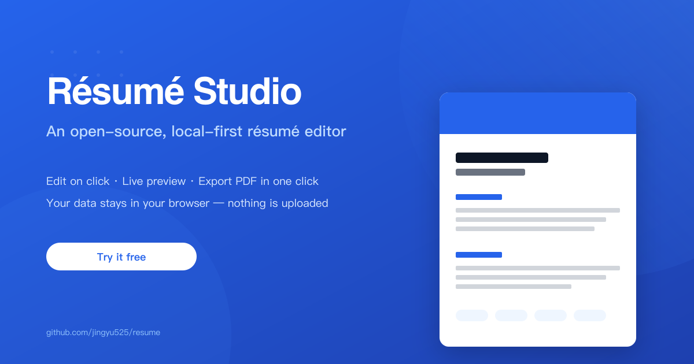

[中文](./README.zh.md) · [English](./README.md) · [日本語](./README.ja.md) · [Deutsch](./README.de.md) · [한국어](./README.ko.md)

# Résumé Studio · A Local-First Résumé Typesetting Studio

> Build an "Apple-pro-document-grade" résumé without any design background. WYSIWYG, precise A4 pagination, five languages from one source.
> **Everything runs entirely in your browser: no backend, no account, no uploads — your data is never touched.**

[](https://jingyu525.github.io/resume/)
[]()
[]()



## Why Résumé Studio

- **Studio-grade quality, zero design skills** —— No fighting Word's margins and page breaks. Click anywhere to edit, see changes in real time.
- **Your data always stays with you** —— No network, no collection, no uploads; close the tab and take it with you, clear the cache and it's gone.
- **Write once, ship in five languages** —— Chinese / English / Japanese / German / Korean, UI and content switch together, with automatic fallback for missing languages.
- **Free, open source, transparent** —— Public, traceable code; no black boxes.

## Try It Online

No install needed, open and use: **https://jingyu525.github.io/resume/**

## Core Features

- **WYSIWYG + precise A4 pagination**: no single block split across pages, no orphaned section headings, bottom safe zone, live total page count, auto-scaling preview.
- **Edit in place**: click any text in the preview to edit; the selection popover offers only three actions — bold / accent color / reset format; pasted external content is auto-sanitized, keeping only semantics and accent color.
- **Four dimensions of look**: theme color, layout (single column / sidebar two-column), tone (formal / soft / lively), and density slider, with one-click reset to defaults.
- **Five languages from one source**: Chinese / English / Japanese / German / Korean, UI and résumé content switch together, with automatic fallback.
- **Local-first**: auto-saved in the browser, survives refresh; supports export / import of validated backup files.
- **Undo / redo**: continuous typing merges into one step; supports `Ctrl/Cmd+Z`, `Ctrl/Cmd+Shift+Z`, `Ctrl+Y`.
- **Export / save PDF**: one-click PDF export, no system footer, no screen-only elements on paper.

## Privacy Promise

We store none of your data. No backend, no account, no uploads — close the tab and it goes with you, clear the cache and it disappears. That is also what fundamentally sets it apart from most SaaS résumé tools.

This site uses GoatCounter for anonymous, cookie-free visit statistics — no personal data is collected.

Have feedback or found a bug? Tap the feedback button in the editor (top-right) to open a pre-filled GitHub issue — no account needed.

## Quick Start (Local Dev)

```bash
npm install
npm run dev        # local dev (default http://localhost:5173)
```

- `/` —— marketing landing page
- `/editor` —— résumé editor

## Available Scripts

| Command | Description |
|---|---|
| `npm run dev` | Start dev server |
| `npm run build` | Type check + production build |
| `npm run preview` | Preview production build |
| `npm run lint` | ESLint check |
| `npm run typecheck` | Type check only |
| `npm run test` | Run Vitest tests |

## Tech Stack

Vite 7 · React 19 · TypeScript (strict) · Tailwind CSS v4 · Zustand + zundo · DOMPurify · lucide-react · Vitest

Code follows **Feature-Sliced Design**: `app → pages → widgets → features → entities → shared`.
See [`ARCHITECTURE.md`](./ARCHITECTURE.md) for detailed layering, state flow, and key module design.

## Directory Overview

```
src/
├── app/        # entry, providers (I18n/Theme/Toast), routing, global styles
├── pages/      # landing (marketing), editor
├── widgets/    # landing-hero/features/footer, editor-toolbar, preview-pane
├── features/   # resume-editing, inline-richtext, appearance-control, language-switch,
│               # undo-redo, persistence, backup-io, pagination, print-export
├── entities/   # resume / appearance / locale models
├── shared/     # ui (shadcn-style components), lib, types, config, i18n (5-language dict)
└── store/      # Zustand store (with zundo undo/redo), migrations & persistence
tests/          # core pure-logic tests: sanitize / pagination / i18n fallback / undo merge / migration
```

---

Résumé Studio is an open-source project. Stars and contributions are welcome. Sample copy and placeholder content are for demonstration only — replace them with your own information.